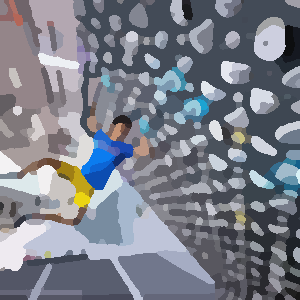

<div align="center">
    <h1>BoardBuddy</h1>
    
    <p>Climb more buddy.</p>
</div>

## Usage

Just visit []().

For local hosting.

```console
$ git clone https://github.com/lczm/boardbuddy
$ npm i && npm start
```

## [License](./LICENSE)

Provisioned under the MIT License.

## Contributors

<table>
	<tbody>
        <tr>
            <td align="center">
                <a href="https://www.linkedin.com/in/chua-ze-ming-798b84162/">
                    
                    <br />
                    <sub><b>Ze Ming Chua</b></sub>
                </a>
                <br />
                <sub><a href="./api/">Backend<a></sub>
            </td>
            <td align="center">
                <a href="https://www.linkedin.com/in/gabriel-zmong/">
                    
                    <br />
                    <sub><b>Gabriel Ong</b></sub>
                </a>
                <br />
                <sub><a href="./boardbuddy-app/">Frontend<a></sub>
            </td>
        </tr>
	</tbody>
</table>